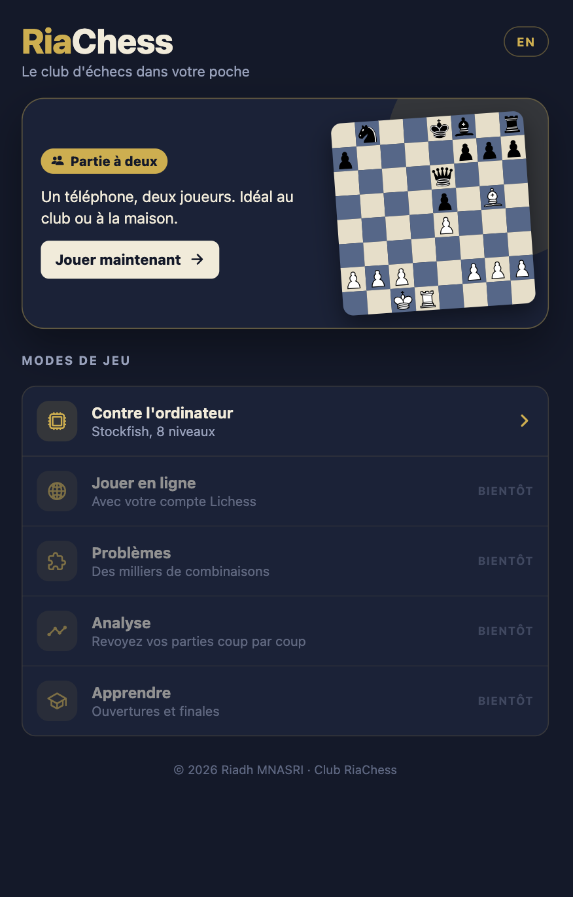
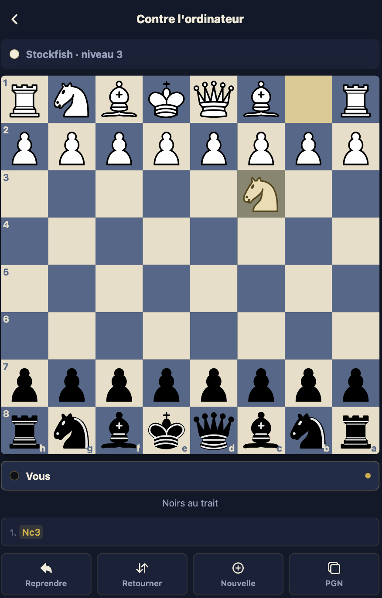

# RiaChess mobile

[English version](README.en.md)

Application mobile d'échecs du club [RiaChess](https://riachess.fr), pour Android et iPhone. Objectif : réunir dans une seule appli le jeu (à deux, contre l'ordinateur, en ligne), les problèmes, l'analyse des parties et l'apprentissage des ouvertures et des finales, avec le suivi pédagogique du club.

<p>
  
  &nbsp;
  
</p>

## Sommaire

- [Fonctionnalités](#fonctionnalités)
- [Tester sur un téléphone Android](#tester-sur-un-téléphone-android)
- [Stack technique](#stack-technique)
- [Architecture](#architecture)
- [Moteur d'échecs](#moteur-déchecs)
- [Démarrer en local](#démarrer-en-local)
- [Scripts npm](#scripts-npm)
- [Tests](#tests)
- [Builds et publication](#builds-et-publication)
- [Feuille de route](#feuille-de-route)
- [Contribuer](#contribuer)
- [Licence et crédits](#licence-et-crédits)

## Fonctionnalités

### Disponibles

**Échiquier**
- Coups au toucher (pièce puis case) ou au glisser-déposer.
- Cases jouables affichées, captures signalées par un anneau.
- Surlignage du dernier coup et du roi en échec.
- Coordonnées sur le bord du plateau, plateau retournable.
- Choix de la pièce lors d'une promotion.
- Pièces vectorielles nettes à toutes les tailles d'écran.

**Partie à deux** : deux joueurs sur le même appareil.

**Contre l'ordinateur** : Stockfish 19, 8 niveaux, choix des Blancs, des Noirs ou au hasard. L'ordinateur réfléchit sans bloquer l'interface. « Reprendre » annule votre coup et celui de l'ordinateur.

**Pendant la partie**
- Détection de l'échec, du mat et des nulles : pat, triple répétition, règle des 50 coups, matériel insuffisant.
- Pièces prises et avantage matériel affichés pour chaque camp.
- Liste des coups en notation algébrique.
- Copie de la partie au format PGN, avec la date et les noms des joueurs.
- Retour haptique à chaque coup sur téléphone.

**Général** : interface en français et en anglais (langue de l'appareil par défaut, bascule depuis l'accueil), thème bleu nuit et or du club.

### À venir

Jeu en ligne via Lichess, problèmes, analyse, section Apprendre, compte RiaChess : voir la [feuille de route](#feuille-de-route).

## Tester sur un téléphone Android

**Avec l'APK (recommandé).** Un APK de test se construit avec EAS (voir [Builds et publication](#builds-et-publication)). Sur le téléphone :
1. Ouvrir le lien de téléchargement fourni par EAS.
2. Autoriser l'installation d'applications depuis le navigateur si Android le demande.
3. Installer puis ouvrir RiaChess.

**Avec Expo Go (sans installation).**
1. Installer [Expo Go](https://play.google.com/store/apps/details?id=host.exp.exponent) sur le téléphone.
2. Lancer `npm start` sur l'ordinateur, le téléphone étant sur le même Wi-Fi.
3. Scanner le QR code affiché dans le terminal.

## Stack technique

| Domaine | Choix |
| --- | --- |
| Framework | [Expo](https://expo.dev) SDK 57, React Native 0.86, TypeScript strict |
| Navigation | Expo Router (écrans dans `src/app/`) |
| Règles du jeu | [chess.js](https://github.com/jhlywa/chess.js) |
| Échiquier | Composant maison : react-native-gesture-handler, react-native-svg |
| Moteur | [Stockfish.js](https://github.com/nmrugg/stockfish.js) 19 (WASM), Web Worker ou WebView |
| Tests | Jest (`jest-expo`) |
| Builds | EAS Build (Android et iOS dans le cloud) |

## Architecture

Le code sépare les règles du jeu de l'affichage, pour que la logique reste testable sans téléphone :

```
src/
  app/                    écrans Expo Router
    index.tsx             accueil
    play/local.tsx        partie à deux
    play/bot.tsx          partie contre l'ordinateur
  domain/                 logique pure, sans React ni React Native
    game.ts               état de partie, coups, statut, matériel, PGN
    bot.ts                niveaux de l'ordinateur, choix du coup
  infrastructure/
    engine/               adaptateurs vers Stockfish
      uci.ts              protocole UCI, file d'attente des demandes
      EngineHost.tsx      Android et iOS : WebView invisible
      EngineHost.web.tsx  web : Web Worker
      bootstrap.ts        démarrage du worker Stockfish
  ui/
    board/                échiquier, géométrie, pièces SVG
    game/GameView.tsx     écran de partie commun aux modes de jeu
    theme.ts              couleurs du club
  i18n/                   textes FR/EN
scripts/
  build-engine.mjs        embarque Stockfish au moment de l'installation
```

**Principes**
- `domain/` ne dépend d'aucun framework. Un état de partie est immuable : chaque coup produit un nouvel état.
- L'accès au moteur passe par une interface UCI (`UciTransport`). Remplacer la WebView par un module natif ne touchera pas au reste de l'appli.
- Metro choisit l'adaptateur selon la plateforme grâce aux suffixes `.web.tsx` et `.tsx`.

## Moteur d'échecs

L'appli embarque **Stockfish 19 « lite », version single-thread** : 1,8 Mo de WASM, avec un réseau de neurones allégé. À l'installation des dépendances, `scripts/build-engine.mjs` le convertit en module TypeScript (`src/infrastructure/engine/generated/`, non versionné). Le moteur fonctionne donc **hors ligne**.

- **Web** : le moteur tourne dans un Web Worker créé à partir du script embarqué.
- **Android et iOS** : le même worker tourne dans une WebView invisible. Ça fonctionne dans Expo Go, sans module natif. Un module natif C++, plus rapide, est prévu avec l'analyse.

**Niveaux**

| Niveau | Nom | Skill Level | Profondeur | Temps max | Coups au hasard |
| --- | --- | --- | --- | --- | --- |
| 1 | Découverte | 0 | 1 | 50 ms | 45 % |
| 2 | Débutant | 0 | 2 | 100 ms | 25 % |
| 3 | Débutant + | 2 | 3 | 150 ms | 12 % |
| 4 | Club | 5 | 5 | 200 ms | 5 % |
| 5 | Club + | 8 | 6 | 300 ms | 0 % |
| 6 | Confirmé | 11 | 8 | 400 ms | 0 % |
| 7 | Fort | 15 | 12 | 600 ms | 0 % |
| 8 | Maximum | 20 | 18 | 1 s | 0 % |

Même réglé au plus faible, Stockfish reste trop fort pour un débutant. Les premiers niveaux jouent donc une partie de leurs coups au hasard. Ces réglages sont dans `src/domain/bot.ts`.

## Démarrer en local

**Prérequis** : Node.js 20 ou plus récent, npm.

```bash
git clone https://github.com/riadh-mnasri/riachess-mobile.git
cd riachess-mobile
npm install        # installe les dépendances et embarque Stockfish
npm run web        # ouvre l'appli dans le navigateur : http://localhost:8190
npm start          # serveur Metro sur le port 8190, pour Expo Go ou un build de développement
```

Le port de développement est **8190**. Aucune variable d'environnement n'est nécessaire pour l'instant.

## Scripts npm

| Commande | Rôle |
| --- | --- |
| `npm start` | Serveur Metro (port 8190) |
| `npm run web` | Version web dans le navigateur |
| `npm run android` / `npm run ios` | Ouvre l'appli sur un émulateur ou un appareil |
| `npm test` | Tests Jest |
| `npm run typecheck` | Vérification TypeScript |
| `postinstall` | Régénère le module Stockfish embarqué (automatique) |

## Tests

```bash
npm test
npm run typecheck
```

Les tests couvrent :
- **le domaine** : coups légaux, mat, pat, promotion, reprise, matériel, export PGN, niveaux et choix du coup de l'ordinateur ;
- **la géométrie du plateau** : case touchée selon l'orientation, lecture du FEN ;
- **l'adaptateur UCI**, avec un faux moteur : initialisation, meilleur coup, demandes traitées l'une après l'autre.

Les tests suivent la structure `Given / When / Then`.

## Builds et publication

Les builds passent par [EAS](https://docs.expo.dev/eas/), sans Android Studio ni Xcode en local. Profils définis dans `eas.json` :

| Profil | Sortie | Usage |
| --- | --- | --- |
| `preview` | APK Android installable | Tests sur téléphone |
| `development` | Build de développement | Déboguer du code natif |
| `production` | AAB (Play Store), IPA (App Store) | Publication |

```bash
npx eas-cli@latest login
npx eas-cli@latest build --platform android --profile preview
```

Pour publier sur Google Play, un compte développeur personnel doit d'abord faire un test fermé avec 12 testeurs pendant 14 jours.

## Feuille de route

| Phase | Contenu | État |
| --- | --- | --- |
| 1. Fondations | Échiquier, partie à deux, PGN, FR/EN | Fait |
| 2. Contre l'ordinateur | Stockfish, 8 niveaux | Fait |
| 3. Analyse | Barre d'évaluation, meilleurs coups, classement des erreurs, import Lichess / chess.com | À venir |
| 4. Problèmes | Base de puzzles Lichess (CC0) hors ligne, classement, thèmes | À venir |
| 5. Apprendre | Répertoires d'ouvertures en répétition espacée, leçons de finales | À venir |
| 6. Jeu en ligne | Parties sur Lichess via l'API officielle | À venir |
| 7. Comptes | Connexion avec le compte riachess.fr, statut premium | À venir |
| 8. Espace club | Devoirs donnés par le coach, suivi des élèves | Après le MVP |

## Contribuer

- Messages de commit au format Angular : `type(scope): sujet` (ex. `feat(board): add premoves`).
- Avant de proposer un changement : `npm test` et `npm run typecheck` doivent passer.
- Toute logique de jeu va dans `src/domain/`, avec ses tests.

## Licence et crédits

- Code sous licence [GPL-3.0-or-later](LICENSE), compatible avec Stockfish.
- [Stockfish](https://stockfishchess.org) (GPLv3), dans son portage WASM [Stockfish.js](https://github.com/nmrugg/stockfish.js) de Nathan Rugg.
- Pièces « cburnett » de Colin M.L. Burnett (GPLv2+), le jeu de pièces par défaut de [Lichess](https://lichess.org).
- [chess.js](https://github.com/jhlywa/chess.js) (BSD-2-Clause).

© 2026 Riadh MNASRI
